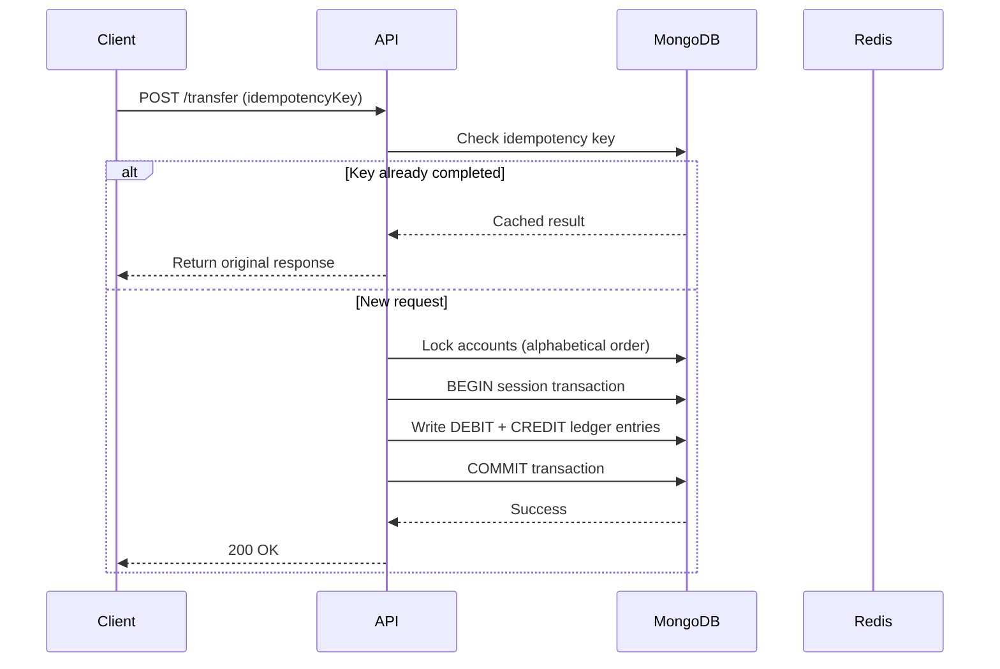
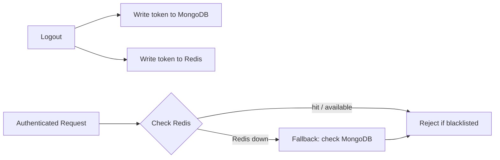

# LedgerFlow


A high-reliability banking simulation backend built to demonstrate production-grade consistency patterns: double-entry ledger bookkeeping, pessimistic concurrency control, and idempotent API design — the same primitives real payment systems rely on to never lose or duplicate money.

---

## Table of Contents

- [Why This Project](#why-this-project)
- [Core Features & Architecture](#core-features--architecture)
- [Tech Stack](#tech-stack)
- [Project Structure](#project-structure)
- [Getting Started](#getting-started)
- [Environment Variables](#environment-variables)
- [API Documentation](#api-documentation)
- [Security & Design Decisions](#security--design-decisions)
- [Contributing](#contributing)
- [License](#license)

---

## Why This Project

Most CRUD backends store a `balance` field and update it in place — which works until two concurrent transfers race each other, or a network retry silently double-charges someone. LedgerFlow is built the way real ledger systems are: balances are *derived*, never stored, and every write path is designed assuming the network will fail at the worst possible moment.

---

## Core Features & Architecture

### 1. Double-Entry Ledger Bookkeeping
Account balances are never stored as a mutable column. Instead, every transaction writes immutable `DEBIT` and `CREDIT` records to a `ledger` collection, and balances are computed on read by aggregating those records. This makes balance drift structurally impossible and gives every account a tamper-evident audit trail for free.

### 2. ACID Transactions & Concurrency Control
To prevent double-spending under concurrent load:
- Every transfer runs inside a MongoDB session transaction.
- Before mutating either account, the system takes a pessimistic write lock via an atomic `findOneAndUpdate` that only matches documents with `status: ACTIVE`.
- If any step in the transaction fails, the entire operation is aborted and rolled back — no partial writes are ever visible to other readers.

### 3. API Idempotency
Client retries (a very real failure mode on flaky mobile networks) should never result in double execution:
- Every transaction request carries a client-generated `idempotencyKey`.
- A repeated request with the same key is intercepted: if the original completed, its response is re-served; if it's still in flight, the client is told to wait; if it failed, the client is told to retry with a fresh key.

### 4. Resilient Auth Blacklist (Double-Write Cache)
- Logging out writes the invalidated token to **both** MongoDB (source of truth) and Redis (cache).
- Auth middleware checks Redis first for speed, falling back cleanly to MongoDB if Redis is unavailable — so a cache outage degrades latency, not correctness.

### Request Flow



### Auth Check Flow



---

## Tech Stack

| Layer | Technology |
|---|---|
| Runtime | Node.js |
| Framework | Express.js |
| Database | MongoDB (via Mongoose) |
| Caching | Redis |
| Auth | JSON Web Tokens (JWT) + Cookie parser |
| Validation | Zod |
| Notifications | Nodemailer + Google OAuth2 SMTP |
| API Docs | Swagger / OpenAPI |
| CI/CD | GitHub Actions |
| Containerization | Docker + Docker Compose |

---

## Project Structure

```text
LedgerFlow/
├── src/
│   ├── app.js                     # Express application configuration
│   ├── config/
│   │   ├── db.js                  # MongoDB Mongoose connection
│   │   ├── redis.js               # Redis client connection configuration
│   │   └── swagger.js             # Swagger/OpenAPI setup configuration
│   ├── controllers/
│   │   ├── account.controller.js
│   │   ├── auth.controller.js
│   │   └── transaction.controller.js
│   ├── middleware/
│   │   ├── auth.middleware.js      # Auth and role guards
│   │   └── validation.middleware.js # Zod validation schema runner
│   ├── models/
│   │   ├── account.model.js
│   │   ├── blackList.model.js
│   │   ├── ledger.model.js
│   │   ├── transaction.model.js
│   │   └── user.model.js
│   └── services/
│       └── email.service.js        # OAuth2 transactional email service
├── server.js                       # App entrypoint
├── docker-compose.yml               # Multi-container compose configuration
├── Dockerfile                       # Node Alpine deployment configuration
└── .env.example                     # Configuration template
```

---

## Getting Started

### Prerequisites
- Node.js 18+ and npm
- Docker & Docker Compose (recommended path)
- MongoDB **must run as a replica set** — session transactions are not supported on a standalone instance. The provided `docker-compose.yml` handles this automatically.

### Option 1: Docker Compose (Recommended)
Runs the full stack — web app, MongoDB replica set, and Redis — with automatic bootstrapping and persistent storage.

```bash
git clone <repo-url>
cd LedgerFlow
cp .env.example .env
docker-compose up --build
```

App will be available at [http://localhost:4000](http://localhost:4000).

### Option 2: Running Locally
Requires your own MongoDB replica set and Redis instance already running.

```bash
npm install
cp .env.example .env
npm run dev
```

---

## Environment Variables

Fill these in against your own `.env.example` — adjust names/values to match your actual config:

| Variable | Description |
|---|---|
| `PORT` | Port the Express server listens on |
| `MONGO_URI` | MongoDB connection string (replica set) |
| `REDIS_URL` | Redis connection string |
| `JWT_SECRET` | Signing secret for access tokens |
| `JWT_EXPIRY` | Access token TTL |
| `GOOGLE_CLIENT_ID` | OAuth2 client ID for SMTP |
| `GOOGLE_CLIENT_SECRET` | OAuth2 client secret for SMTP |
| `GOOGLE_REFRESH_TOKEN` | OAuth2 refresh token for Nodemailer |
| `EMAIL_FROM` | Sender address for transactional email |

---

## API Documentation

Full interactive OpenAPI/Swagger docs are mounted at:

**[http://localhost:4000/api/docs](http://localhost:4000/api/docs)**

Recruiters or reviewers can authenticate and run live request simulations against every endpoint directly from the browser — no Postman collection needed.

---

## Security & Design Decisions

- **Deadlock prevention:** account IDs are string-compared and locked in a consistent alphabetical order, eliminating circular-wait deadlocks during concurrent opposite-direction transfers between the same two accounts.
- **Partial-failure handling:** if a ledger write fails mid-flight, the in-progress session transaction is aborted (no partial state is ever committed). The transaction document is then separately marked `FAILED` outside the transaction boundary, and a failure alert email is triggered.
- **Token invalidation:** logout blacklists the JWT until its natural expiration, so a stolen-but-logged-out token can't be replayed.
- **Network isolation:** MongoDB and Redis ports are only exposed inside Docker's internal network to the `web` container — never bound to the host, so they aren't reachable from outside the compose network.

---

## Contributing

Contributions, issues, and feature requests are welcome. Feel free to open an issue or submit a PR.

## License
